# RetroScore - EPL Score Guessing Game

## 🎯 Project Concept
A nostalgic football score guessing game where users test their memory of historical Premier League matches.

## 🎮 Game Concept
1. **User Experience**: Login → Random historical match → Guess score → See results
2. **Memory Focus**: Emphasis on recalling past matches rather than predicting future ones
3. **Historical Data**: Premier League matches from 1992-93 season onwards
4. **Progressive Content**: Start with recent seasons, add historical data gradually

## 📊 Data Strategy
- **Starting Point**: 2024-25 season (just completed)
- **Expansion Plan**: Work backwards through EPL history
- **Source**: CSV data from Football Data UK
- **Scope**: 32+ seasons of Premier League data (~12,000+ matches)

## 📱 Technical 
- **Backend**: Java Spring Boot REST API
- **Frontend**: React web application Expo for app 
- **Database**: JPA/Hibernate with MySQL/PostgreSQL
- **Authentication**: JWT-based user management
- **Core Features**: User registration, random match selection, score tracking

```mermaid
graph TB
    %% User Layer
    subgraph "Client Layer"
        Mobile["📱 Expo/React Native App"]
        Web["🌐 React Web App - Future Enhancement"]
    end
    
    %% Backend Services
    subgraph "Spring Boot Backend"
        Auth["🔐 Authentication Controller - JWT Token Management"]
        User["👤 User Controller - Registration & Profile"]
        Game["🎮 Game Controller - Match Selection & Scoring"]
        Match["⚽ Match Controller - Historical Data Management"]
        Resources["📁 Static Resources - Team Logos & Assets"]
    end
    
    %% Data Layer
    subgraph "Data Layer"
        DB[("🗄️ MySQL/PostgreSQL Database - Users | Matches | Game Sessions")]
        
        subgraph "Data Import"
            CSV["📄 CSV Data Files - Football Data UK - 32+ Seasons"]
            DataService["🔄 Data Import Service - CSV Processing"]
        end
    end
    
    %% Future Enhancements
    subgraph "Coming Soon" 
        Cache["🚀 Redis Cache - Future Enhancement"]
        Storage["☁️ Cloud File Storage - Future Enhancement"]
    end
    
    %% Connections
    Mobile --> Auth
    Mobile --> User
    Mobile --> Game
    Mobile --> Match
    Web -.-> Auth
    Web -.-> User
    Web -.-> Game
    Web -.-> Match
    
    Auth --> DB
    User --> DB
    Game --> DB
    Match --> DB
    Match --> Resources
    
    DataService --> CSV
    DataService --> DB
    
    %% Future connections (dotted)
    Game -.-> Cache
    Match -.-> Cache
    Resources -.-> Storage
    
    %% Styling
    classDef client fill:#e1f5fe,stroke:#01579b,stroke-width:3px,color:#000000
    classDef backend fill:#f3e5f5,stroke:#4a148c,stroke-width:3px,color:#000000
    classDef database fill:#e8f5e8,stroke:#1b5e20,stroke-width:3px,color:#000000
    classDef future fill:#f5f5f5,stroke:#9e9e9e,stroke-width:3px,stroke-dasharray: 5 5,color:#000000
    
    class Mobile,Web client

    class Auth,User,Game,Match,Resources backend
    class DB,CSV,DataService database
    class Cache,Storage future
```

